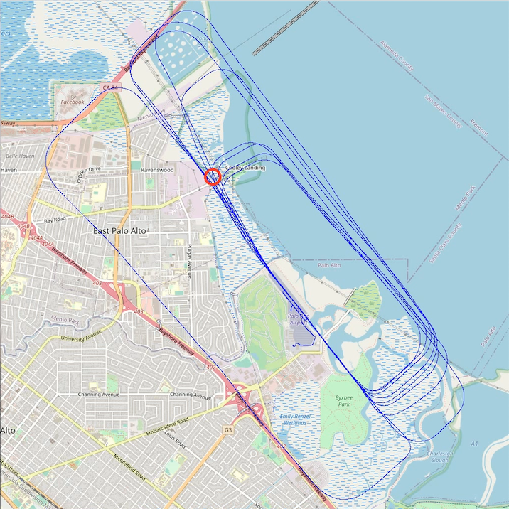

# openmaps_tiler

This repository contains tools for ingesting [GPX data](https://en.wikipedia.org/wiki/GPS_Exchange_Format) from GoPro video files and generating video files representing the location and time from the stream as well as representing the overall location track as a background annotation. The intention is to have two main view types:

1. An overview map view showing the current position relative to the zoomed out complete track

2. A chase map view showing a zoomed in view of the current location position

Map data is obtained from [OpenStreetMap](https://en.wikipedia.org/wiki/OpenStreetMap) which has tiles available to download and use under the [Open Database License](https://en.wikipedia.org/wiki/Open_Database_License).

This repository contains two main scripts for generating these views as well as supporting modules to achieve this.

## Installation

Installation by pip to user enviroment (***repository is currently private***):

```
pip install --user git+ssh://git@github.com/stakita/openmaps_tiler
```

Installation by pip from github:

```
pip install --user git+https://github.com/stakita/openmaps_tiler
```

## Data Types

To use Open Street Map tiles, we need to convert between 3 representations of geolocation data:

1. **Coordinate** - Longitude and latitude coordinates
   * This is what we use in the real world
2. **TilePoint** - Open Street Map tile coordinates
   * This is a scaled mapping where the integer portion of the x and y parameters represent a tile grid identifier
3. **PixelPoint** - Tile pixel coordinates
   * When the tile coordinates are expanded out to specific pixels in the tile (tiles are 256 * 256 pixels)

Converting between these types allows us to resolve a Coordinate object (longitude/latitude) to a tile coordinate (for tile retrieval), and then reference a specific  pixel in the tile that the original Coordinate object corresponds to.

One complicating factor is that the y-axis for TilePoint and PixelPoint space runs opposite to longitude - as longitude increases, TilePoint and PixelPoint y-values decrease. This has ramifications for bounding boxes

## Scripts

### tile_download.py

This tool allows for manual download of tiles based on longitude and latitude. Mostly for testing.

### create_overview_video.py - Generate track overview video

This tool takes a gpx file and generates an overview video. This is basically where the entire track is contained in one view and the position updates over time.



The process for generating this is as follows:

1. Calculate the bounds of the view based on:
   
   * viewport dimensions
   
   * track extents
   
   * boundary margin constraints

2. Generate background image
   
   * download tiles
   
   * assemble background image
   
   * scale and crop to viewport dimensions

3. Generate video annotating location at each point in time

### create_chase_video.py - Generate track chase video

This tool takes a gpx file and generates a chase video which is a view where the current location is centered in the viewport and the map shifts as the location updates. The view contains the track of points over the whole session. The idea here is that it is a close up of the state around the current position.


#### Process

The general process for generating the chase video is as follows:

1. **Setup:** calculate viewport span values based on output video dimensions and zoom factor, load GPX data

2. **Download tiles:** download all tiles relevant for rendering all chase frames for the track

3. **Annotate tiles:** draw track points on all tiles (tiles are ephemeral so we use them directly)

4. **Compose video:** compose video frame by frame based on the location point and time data

##### 1. Setup

The following parameters are supplied for a given run:

* zoom factor (in openstreetmaps zoom value)

* viewport dimensions for output video in pixels (x and y)

Given that zoom is fixed, and the viewport dimensions in pixels are supplied, it is a fixed ratio of pixels and therefore tiles to cover the viewport. With a given point, all relevant tiles can be calculated to determine the span of tiles for rendering the viewport based on the current location position.

This offset must be retained in pixels to be valid.

GPX data needs to be loaded.

##### 2. Download tiles

To start, all tiles are downloaded so they are available to the later processes. The process for doing this is:

* For each track point:
  
  1. Determine the span of tiles for rendering that track point
  
  2. For each tile in the set:
     
     * Check if it is in the cache and download it if it isn't

##### 3. Annotate tiles

We annotate the tiles so they contain the track points so they are already present in the later rendering stage. To annotate the tiles we do the following:

Note: this is not optimized and may not be performant

1. Determine the set of tiles that actually have tracks on them
   
   * For each point in the position track
     
     1. Determine which tile it exists on
     
     2. Add this tile to the set of annotation tiles

2. For each tile in the set of annotation tiles
   
   * For each point in the position track
     
     1. Collect all points that occur in that given tile
     
     2. Draw this set of points on the tile
   
   . Save the tile back to the cache

##### 4. Compose video

The video composition process involves composing a frame based on the time and location in the sequence. The time sequence calculation is straightforward.

The frame composition process is outlined in the following image:


This requires the following steps:

1. Get the current location point at the time of the given frame

2. Calculate the pixel point position of the current location

3. Calculate the viewport offset from the current location pixel position in pixels

4. Determine the set tiles that are required for the render
   
   * Generate a list of **tile** and **pixel reference point** pairs for each required tile

5. Render the frame:
   
   1. Assemble each of the tiles in render space
   
   2. Crop to the viewport
   
   3. Add position point marker

6. Append the frame to the video